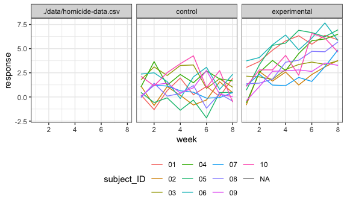
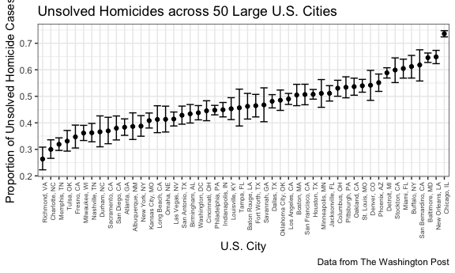

Homework 5
================
Eileen Shea
November 15, 2018

## Problem 1

First we create a dataframe containing all of the file names.

``` r
df = tibble(
  file_name = list.files("./data", full.names = TRUE)
)
```

Next we iterate over file names and read in data for each subject using
`purrr::map`. We will save the result as a new variable in the
dataframe.

``` r
read_file = function(file_name) {
  read_csv(file_name)
}
```

``` r
df_untidy =  
  df %>% 
mutate(
  file_data = map(file_name, read_file)
) 
```

    ## Parsed with column specification:
    ## cols(
    ##   week_1 = col_double(),
    ##   week_2 = col_double(),
    ##   week_3 = col_double(),
    ##   week_4 = col_double(),
    ##   week_5 = col_double(),
    ##   week_6 = col_double(),
    ##   week_7 = col_double(),
    ##   week_8 = col_double()
    ## )
    ## Parsed with column specification:
    ## cols(
    ##   week_1 = col_double(),
    ##   week_2 = col_double(),
    ##   week_3 = col_double(),
    ##   week_4 = col_double(),
    ##   week_5 = col_double(),
    ##   week_6 = col_double(),
    ##   week_7 = col_double(),
    ##   week_8 = col_double()
    ## )
    ## Parsed with column specification:
    ## cols(
    ##   week_1 = col_double(),
    ##   week_2 = col_double(),
    ##   week_3 = col_double(),
    ##   week_4 = col_double(),
    ##   week_5 = col_double(),
    ##   week_6 = col_double(),
    ##   week_7 = col_double(),
    ##   week_8 = col_double()
    ## )
    ## Parsed with column specification:
    ## cols(
    ##   week_1 = col_double(),
    ##   week_2 = col_double(),
    ##   week_3 = col_double(),
    ##   week_4 = col_double(),
    ##   week_5 = col_double(),
    ##   week_6 = col_double(),
    ##   week_7 = col_double(),
    ##   week_8 = col_double()
    ## )
    ## Parsed with column specification:
    ## cols(
    ##   week_1 = col_double(),
    ##   week_2 = col_double(),
    ##   week_3 = col_double(),
    ##   week_4 = col_double(),
    ##   week_5 = col_double(),
    ##   week_6 = col_double(),
    ##   week_7 = col_double(),
    ##   week_8 = col_double()
    ## )
    ## Parsed with column specification:
    ## cols(
    ##   week_1 = col_double(),
    ##   week_2 = col_double(),
    ##   week_3 = col_double(),
    ##   week_4 = col_double(),
    ##   week_5 = col_double(),
    ##   week_6 = col_double(),
    ##   week_7 = col_double(),
    ##   week_8 = col_double()
    ## )
    ## Parsed with column specification:
    ## cols(
    ##   week_1 = col_double(),
    ##   week_2 = col_double(),
    ##   week_3 = col_double(),
    ##   week_4 = col_double(),
    ##   week_5 = col_double(),
    ##   week_6 = col_double(),
    ##   week_7 = col_double(),
    ##   week_8 = col_double()
    ## )
    ## Parsed with column specification:
    ## cols(
    ##   week_1 = col_double(),
    ##   week_2 = col_double(),
    ##   week_3 = col_double(),
    ##   week_4 = col_double(),
    ##   week_5 = col_double(),
    ##   week_6 = col_double(),
    ##   week_7 = col_double(),
    ##   week_8 = col_double()
    ## )
    ## Parsed with column specification:
    ## cols(
    ##   week_1 = col_double(),
    ##   week_2 = col_double(),
    ##   week_3 = col_double(),
    ##   week_4 = col_double(),
    ##   week_5 = col_double(),
    ##   week_6 = col_double(),
    ##   week_7 = col_double(),
    ##   week_8 = col_double()
    ## )
    ## Parsed with column specification:
    ## cols(
    ##   week_1 = col_double(),
    ##   week_2 = col_double(),
    ##   week_3 = col_double(),
    ##   week_4 = col_double(),
    ##   week_5 = col_double(),
    ##   week_6 = col_double(),
    ##   week_7 = col_double(),
    ##   week_8 = col_double()
    ## )
    ## Parsed with column specification:
    ## cols(
    ##   week_1 = col_double(),
    ##   week_2 = col_double(),
    ##   week_3 = col_double(),
    ##   week_4 = col_double(),
    ##   week_5 = col_double(),
    ##   week_6 = col_double(),
    ##   week_7 = col_double(),
    ##   week_8 = col_double()
    ## )
    ## Parsed with column specification:
    ## cols(
    ##   week_1 = col_double(),
    ##   week_2 = col_double(),
    ##   week_3 = col_double(),
    ##   week_4 = col_double(),
    ##   week_5 = col_double(),
    ##   week_6 = col_double(),
    ##   week_7 = col_double(),
    ##   week_8 = col_double()
    ## )
    ## Parsed with column specification:
    ## cols(
    ##   week_1 = col_double(),
    ##   week_2 = col_double(),
    ##   week_3 = col_double(),
    ##   week_4 = col_double(),
    ##   week_5 = col_double(),
    ##   week_6 = col_double(),
    ##   week_7 = col_double(),
    ##   week_8 = col_double()
    ## )

    ## Parsed with column specification:
    ## cols(
    ##   week_1 = col_double(),
    ##   week_2 = col_double(),
    ##   week_3 = col_double(),
    ##   week_4 = col_double(),
    ##   week_5 = col_double(),
    ##   week_6 = col_double(),
    ##   week_7 = col_integer(),
    ##   week_8 = col_double()
    ## )

    ## Parsed with column specification:
    ## cols(
    ##   week_1 = col_double(),
    ##   week_2 = col_double(),
    ##   week_3 = col_double(),
    ##   week_4 = col_double(),
    ##   week_5 = col_double(),
    ##   week_6 = col_double(),
    ##   week_7 = col_double(),
    ##   week_8 = col_double()
    ## )
    ## Parsed with column specification:
    ## cols(
    ##   week_1 = col_double(),
    ##   week_2 = col_double(),
    ##   week_3 = col_double(),
    ##   week_4 = col_double(),
    ##   week_5 = col_double(),
    ##   week_6 = col_double(),
    ##   week_7 = col_double(),
    ##   week_8 = col_double()
    ## )
    ## Parsed with column specification:
    ## cols(
    ##   week_1 = col_double(),
    ##   week_2 = col_double(),
    ##   week_3 = col_double(),
    ##   week_4 = col_double(),
    ##   week_5 = col_double(),
    ##   week_6 = col_double(),
    ##   week_7 = col_double(),
    ##   week_8 = col_double()
    ## )
    ## Parsed with column specification:
    ## cols(
    ##   week_1 = col_double(),
    ##   week_2 = col_double(),
    ##   week_3 = col_double(),
    ##   week_4 = col_double(),
    ##   week_5 = col_double(),
    ##   week_6 = col_double(),
    ##   week_7 = col_double(),
    ##   week_8 = col_double()
    ## )
    ## Parsed with column specification:
    ## cols(
    ##   week_1 = col_double(),
    ##   week_2 = col_double(),
    ##   week_3 = col_double(),
    ##   week_4 = col_double(),
    ##   week_5 = col_double(),
    ##   week_6 = col_double(),
    ##   week_7 = col_double(),
    ##   week_8 = col_double()
    ## )
    ## Parsed with column specification:
    ## cols(
    ##   week_1 = col_double(),
    ##   week_2 = col_double(),
    ##   week_3 = col_double(),
    ##   week_4 = col_double(),
    ##   week_5 = col_double(),
    ##   week_6 = col_double(),
    ##   week_7 = col_double(),
    ##   week_8 = col_double()
    ## )

    ## Parsed with column specification:
    ## cols(
    ##   uid = col_character(),
    ##   reported_date = col_integer(),
    ##   victim_last = col_character(),
    ##   victim_first = col_character(),
    ##   victim_race = col_character(),
    ##   victim_age = col_character(),
    ##   victim_sex = col_character(),
    ##   city = col_character(),
    ##   state = col_character(),
    ##   lat = col_double(),
    ##   lon = col_double(),
    ##   disposition = col_character()
    ## )

Finally we need to tidy the resulting dataframe.

``` r
df_tidy =
  df_untidy %>% 
  unnest() %>% 
  separate(file_name, c("arm", "subject"), sep = "_") %>% 
  separate(subject, c("subject_ID", "remove")) %>% 
  mutate(arm = recode(arm, "./data/con" = "control", "./data/exp" = "experimental")) %>% 
  gather(key = week, value = response, week_1:week_8) %>% 
  separate(week, c("remove2", "week"), sep = "_") %>% 
  select(-remove, -remove2) %>% 
  mutate(week = as.numeric(week)) %>% 
  arrange(arm, subject_ID)
```

    ## Warning: Expected 2 pieces. Missing pieces filled with `NA` in 52179 rows
    ## [21, 22, 23, 24, 25, 26, 27, 28, 29, 30, 31, 32, 33, 34, 35, 36, 37, 38,
    ## 39, 40, ...].

With our tidy dataset we will make a spaghetti plot showing observations
on each subject over time.

``` r
df_tidy %>% 
  ggplot(aes(x = week, y = response, color = subject_ID)) +
  geom_line() +
  facet_grid(~arm)
```

    ## Warning: Removed 417432 rows containing missing values (geom_path).



Based on this plot, we see that the experimental group saw increases in
response over time, while the control group generally stayed the same
over time with some fluctuations by week and possibly even a slight
downward trend.

## Problem 2

First we need to read in the data.

``` r
homicide_data = read_csv("./data/homicide-data.csv")
```

    ## Parsed with column specification:
    ## cols(
    ##   uid = col_character(),
    ##   reported_date = col_integer(),
    ##   victim_last = col_character(),
    ##   victim_first = col_character(),
    ##   victim_race = col_character(),
    ##   victim_age = col_character(),
    ##   victim_sex = col_character(),
    ##   city = col_character(),
    ##   state = col_character(),
    ##   lat = col_double(),
    ##   lon = col_double(),
    ##   disposition = col_character()
    ## )

The raw data includes `ncol(homicide_data)` variables and
`nrow(homicide_data)` observations; each observation represents an
individual homicide case. Variables include a unique ID that
incorporates location information, date the homicide was reported,
victim information (last name, first name, race, age, sex), city, state,
latitude and longitude of the incident, and the disposition
(i.e. status) of the case. Unidentifiable characteristics are reported
as ‘Unknown’.

Next we will create a `city_state` variable.

``` r
US_hom_data = homicide_data %>% 
  mutate(state = toupper(state), city_state = str_c(city, state, sep = ", "))
```

Using this new variable, we will summarize within cities to obtain the
total number of homicides and the number of unsolved homicides (those
for which the disposition is “Closed without arrest” or “Open/No
arrest”).

``` r
US_hom_data %>% 
  group_by(city_state) %>% 
  summarize(n_total = n())
```

    ## # A tibble: 51 x 2
    ##    city_state      n_total
    ##    <chr>             <int>
    ##  1 Albuquerque, NM     378
    ##  2 Atlanta, GA         973
    ##  3 Baltimore, MD      2827
    ##  4 Baton Rouge, LA     424
    ##  5 Birmingham, AL      800
    ##  6 Boston, MA          614
    ##  7 Buffalo, NY         521
    ##  8 Charlotte, NC       687
    ##  9 Chicago, IL        5535
    ## 10 Cincinnati, OH      694
    ## # ... with 41 more rows

This `group_by` shows 51 distinct city-state combinations when there
should only be 50; moreover, the summary data shows ‘Tulsa, AL’ with 1
homicide. This seems like a mistake since 1 is inconsistent with the
other `n_total` numbers, and ‘Tulsa, AL’ is also not a real place. This
observartion will be dropped and we will re-do the summary.Furthermore,
we also need a variable that indicates whether a homicide was unsolved.

``` r
US_hom_data_50 = US_hom_data %>% 
  filter(city_state != "Tulsa, AL") %>% 
  mutate(unsolved = ifelse(disposition == "Closed without arrest" | disposition == "Open/No arrest", TRUE, FALSE))

US_hom_data_50 %>% 
  group_by(city_state) %>% 
  summarize(n_total = n(), n_unsolved = sum(unsolved)) %>% 
  arrange(desc(n_total)) %>% 
  knitr::kable()
```

| city\_state        | n\_total | n\_unsolved |
| :----------------- | -------: | ----------: |
| Chicago, IL        |     5535 |        4073 |
| Philadelphia, PA   |     3037 |        1360 |
| Houston, TX        |     2942 |        1493 |
| Baltimore, MD      |     2827 |        1825 |
| Detroit, MI        |     2519 |        1482 |
| Los Angeles, CA    |     2257 |        1106 |
| St. Louis, MO      |     1677 |         905 |
| Dallas, TX         |     1567 |         754 |
| Memphis, TN        |     1514 |         483 |
| New Orleans, LA    |     1434 |         930 |
| Las Vegas, NV      |     1381 |         572 |
| Washington, DC     |     1345 |         589 |
| Indianapolis, IN   |     1322 |         594 |
| Kansas City, MO    |     1190 |         486 |
| Jacksonville, FL   |     1168 |         597 |
| Milwaukee, WI      |     1115 |         403 |
| Columbus, OH       |     1084 |         575 |
| Atlanta, GA        |      973 |         373 |
| Oakland, CA        |      947 |         508 |
| Phoenix, AZ        |      914 |         504 |
| San Antonio, TX    |      833 |         357 |
| Birmingham, AL     |      800 |         347 |
| Nashville, TN      |      767 |         278 |
| Miami, FL          |      744 |         450 |
| Cincinnati, OH     |      694 |         309 |
| Charlotte, NC      |      687 |         206 |
| Oklahoma City, OK  |      672 |         326 |
| San Francisco, CA  |      663 |         336 |
| Pittsburgh, PA     |      631 |         337 |
| New York, NY       |      627 |         243 |
| Boston, MA         |      614 |         310 |
| Tulsa, OK          |      583 |         193 |
| Louisville, KY     |      576 |         261 |
| Fort Worth, TX     |      549 |         255 |
| Buffalo, NY        |      521 |         319 |
| Fresno, CA         |      487 |         169 |
| San Diego, CA      |      461 |         175 |
| Stockton, CA       |      444 |         266 |
| Richmond, VA       |      429 |         113 |
| Baton Rouge, LA    |      424 |         196 |
| Omaha, NE          |      409 |         169 |
| Albuquerque, NM    |      378 |         146 |
| Long Beach, CA     |      378 |         156 |
| Sacramento, CA     |      376 |         139 |
| Minneapolis, MN    |      366 |         187 |
| Denver, CO         |      312 |         169 |
| Durham, NC         |      276 |         101 |
| San Bernardino, CA |      275 |         170 |
| Savannah, GA       |      246 |         115 |
| Tampa, FL          |      208 |          95 |

For the city of Baltimore, MD we will now use the `prop.test` fuction to
estimate the proportion of homicides that are unsolved; we save the
output of prop.test as an R object, apply the `broom::tidy` function to
this object and pull the estimated proportion and confidence intervals
from the resulting tidy dataframe.

``` r
Baltimore_prop_data = US_hom_data_50 %>% 
 group_by(city_state) %>%
  mutate(n_total = n(), n_unsolved = sum(unsolved)) %>% 
  distinct(city_state, n_total, n_unsolved) %>%
  filter(city_state == "Baltimore, MD")

prop_unsolved_Baltimore = prop.test(Baltimore_prop_data$n_unsolved, Baltimore_prop_data$n_total)

prop_unsolved_Baltimore %>% 
  broom::tidy() %>% 
  select(estimate, conf.low, conf.high) %>% 
  knitr::kable()
```

|  estimate |  conf.low | conf.high |
| --------: | --------: | --------: |
| 0.6455607 | 0.6275625 | 0.6631599 |

Next we will run `prop.test` for each city.

``` r
prop_data = US_hom_data_50 %>% 
 group_by(city_state) %>%
  mutate(n_total = n(), n_unsolved = sum(unsolved)) %>% 
  distinct(city_state, n_total, n_unsolved) 
```

``` r
filter_city = function(city) {
  city_prop_data = prop_data %>% 
    filter(city_state == city)
}

city_prop_data = map(prop_data$city_state, filter_city)
```

``` r
prop_test = function(city_prop_data, city_state) {
  prop.test(city_prop_data$n_unsolved, city_prop_data$n_total) %>% 
    broom::tidy() %>% 
  select(estimate, conf.low, conf.high)
}

output = map_df(city_prop_data, prop_test)
```

Now we need to merge the two dataframes.

``` r
prop_df_ID = prop_data %>% 
  rowid_to_column("ID")

output_ID = output %>% 
  rowid_to_column("ID")

df_merge = merge(prop_df_ID, output_ID, by = "ID")

df_final = df_merge %>% 
  select(-ID)
```

Lastly, we will create a plot that shows the estimates and CIs for each
city.

``` r
df_final %>% 
  mutate(city_state = forcats::fct_reorder(city_state, estimate)) %>% 
  ggplot(aes(x = city_state, y = estimate)) +
  geom_point() +
  geom_errorbar(aes(ymin = conf.low, ymax = conf.high)) +
  theme(axis.text.x = element_text(angle = 90, hjust = 1, size = 6)) +
  labs(
    title = "Unsolved Homicides across 50 Large U.S. Cities",
    x = "U.S. City",
    y = "Proportion of Unsolved Homicide Cases",
    caption = "Data from The Washington Post"
  ) 
```


